# System Flow Diagrams

## 1. User Authentication Flow

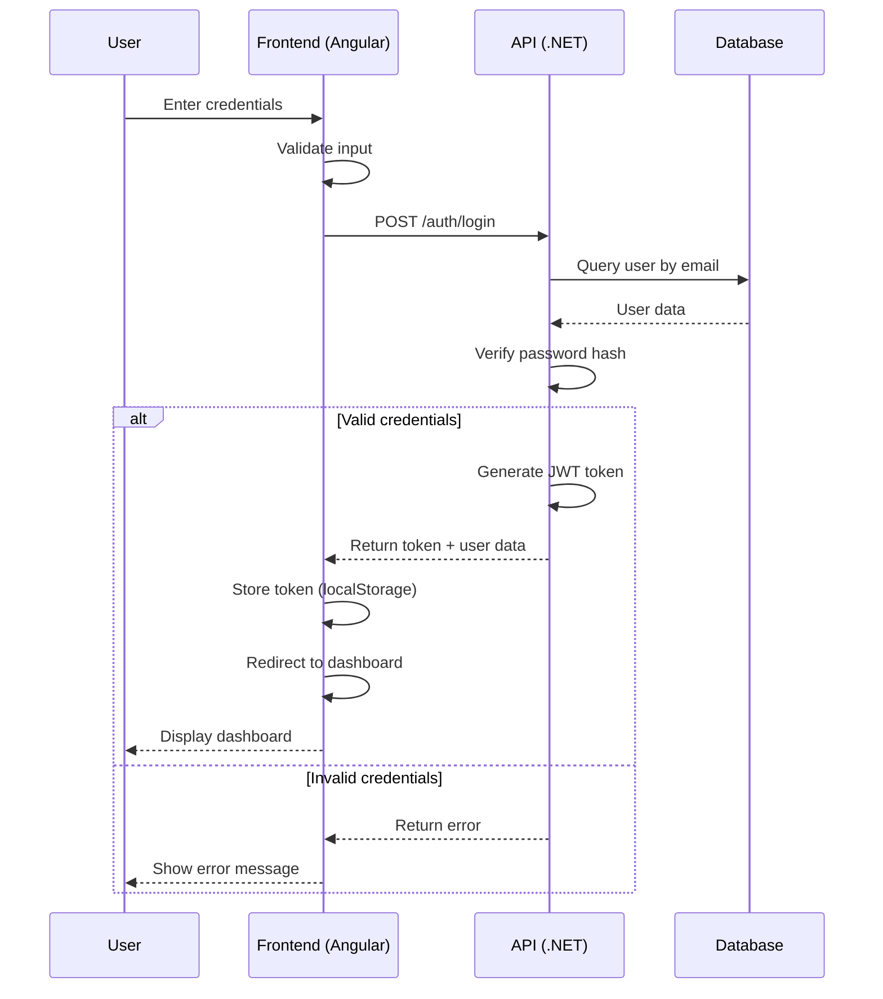

## 2. Attendance Login Flow

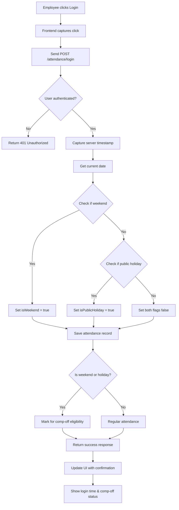

## 3. Attendance Logout Flow

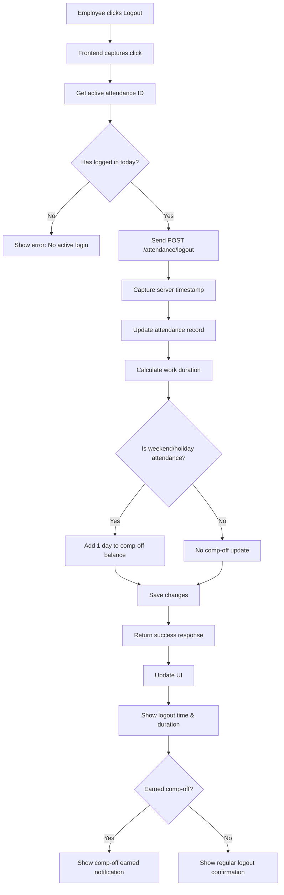

## 4. Leave Request Flow

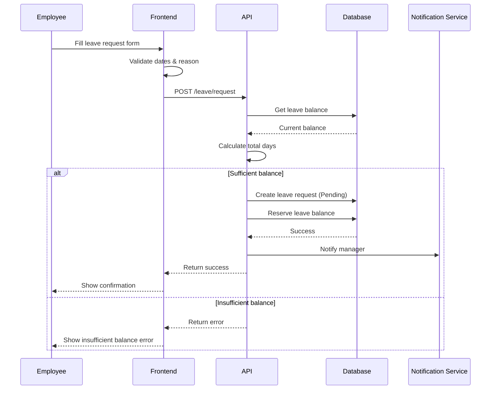

## 5. Leave Approval Workflow

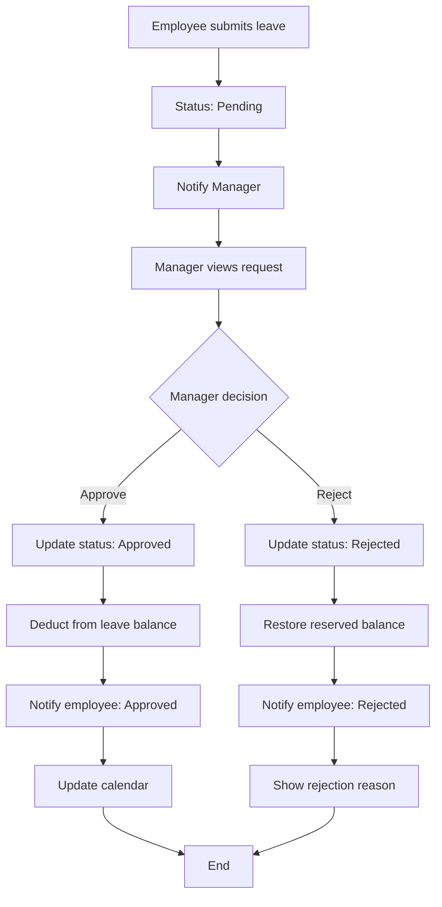

## 6. Manager Approval Process

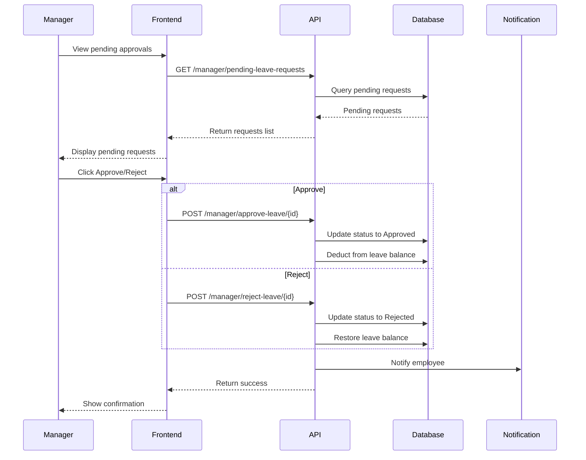

## 7. Admin User Creation Flow

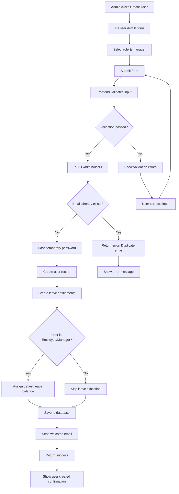

## 8. Holiday Calendar Management

```mermaid
flowchart TD
    A[Admin accesses Holiday Management] --> B[View current holidays]
    B --> C{Action?}
    C -->|Add| D[Fill holiday form]
    C -->|Edit| E[Select holiday to edit]
    C -->|Delete| F[Select holiday to delete]
    D --> G[Enter date, name, description]
    G --> H[Submit]
    H --> I{Date already exists?}
    I -->|Yes| J[Show error: Duplicate date]
    I -->|No| K[POST /admin/holidays]
    K --> L[Save to database]
    L --> M[Update attendance system]
    M --> N[Return success]
    N --> O[Refresh holiday list]
    E --> P[Update holiday details]
    P --> Q[PUT /admin/holidays/{id}]
    Q --> L
    F --> R{Confirm deletion?}
    R -->|Yes| S[DELETE /admin/holidays/{id}]
    R -->|No| O
    S --> T[Remove from database]
    T --> O
    J --> U[Admin corrects date]
    U --> H
```

## 9. Compensatory Off Accrual

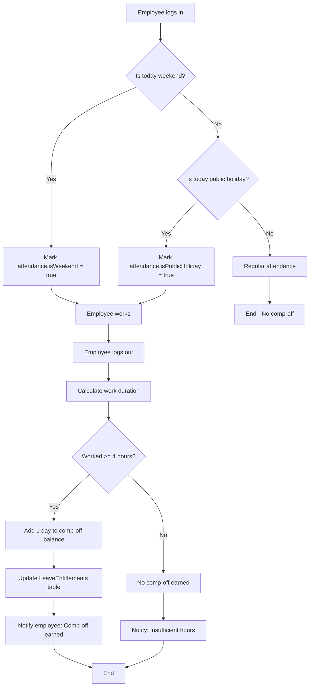

## 10. Role-Based Access Control

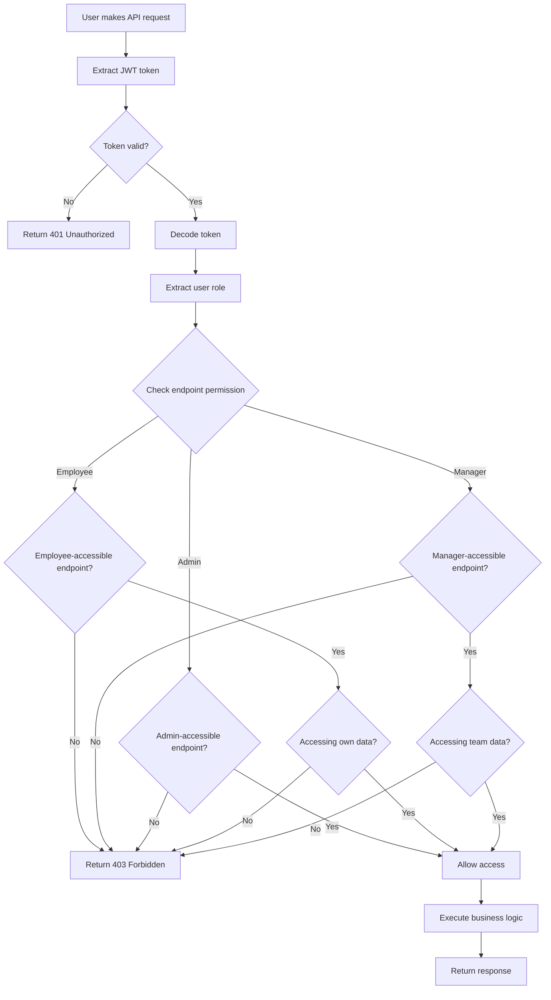

## 11. System Startup Flow

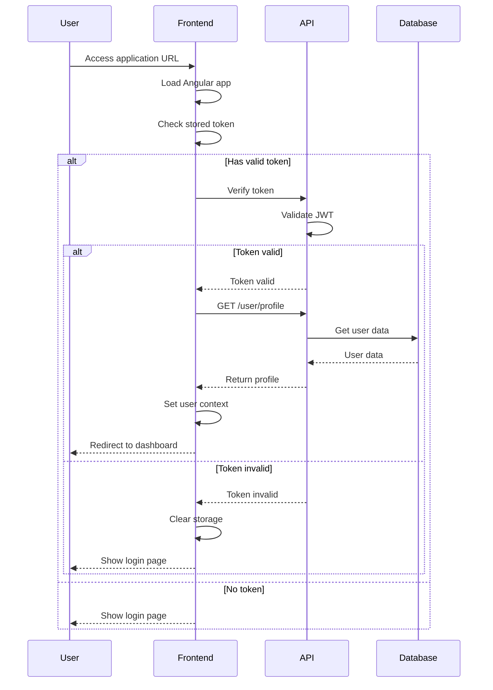

## 12. Data Synchronization Flow

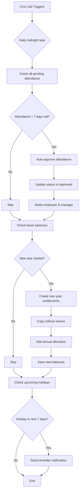

---

## Diagram Legend

- **Rectangles**: Process steps
- **Diamonds**: Decision points
- **Rounded rectangles**: Start/End points
- **Arrows**: Flow direction
- **Participants**: System components

---

**Last Updated**: October 15, 2025
